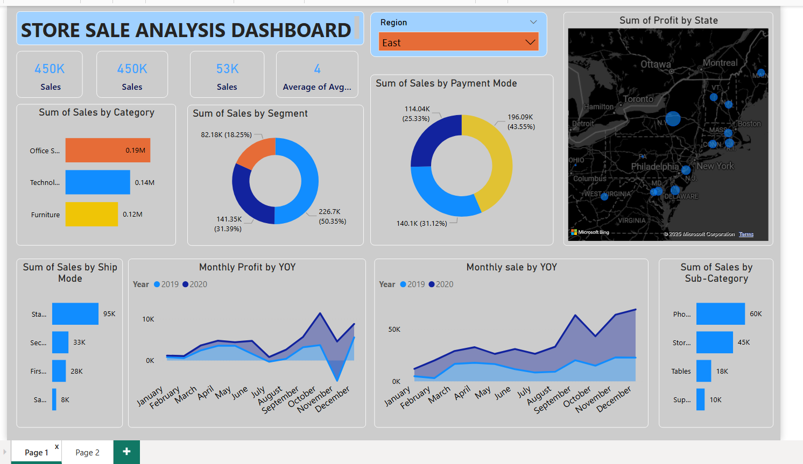
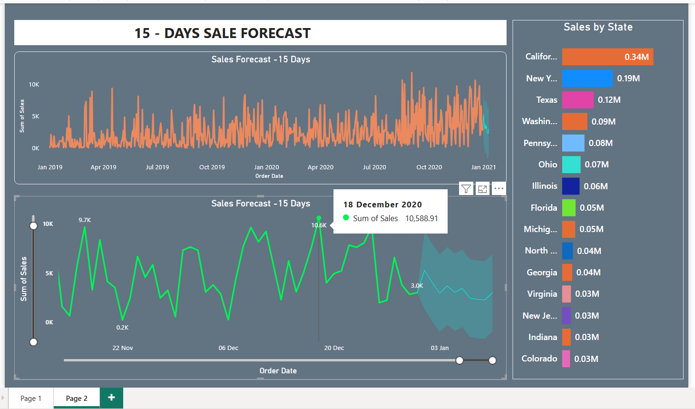

# 📊 Store Sales Analysis Dashboard  

This repository contains an **interactive Power BI dashboard** for analyzing and forecasting store sales performance across different categories, regions, and time periods.  

##  Features  
- **Sales Overview**:  
  - Total Sales, Profit, and Average Order metrics at a glance.  
  - Sales breakdown by **Category, Sub-Category, Segment, State, and Shipping Mode**.  

- **Profitability Analysis**:  
  - Geographic view of profit by state.  
  - Contribution by product segments and categories.  

- **Trend Analysis (YOY)**:  
  - Monthly Sales and Profit comparison across years.  
  - Sales performance monitoring with seasonal patterns.  

- **Payment Modes & Ship Mode Analysis**:  
  - Distribution of transactions by payment mode.  
  - Insights into order shipment preferences.  

- **Sales Forecasting (15 Days)**:  
  - Short-term forecasting using time series models.  
  - Interactive visualization for demand planning.  

## 🛠️ Tools & Technologies  
- **Power BI** (Data Visualization & Dashboarding)  
- **Excel / CSV Dataset** (Data Source)  
- **Time Series Forecasting** (Sales Projection)  

